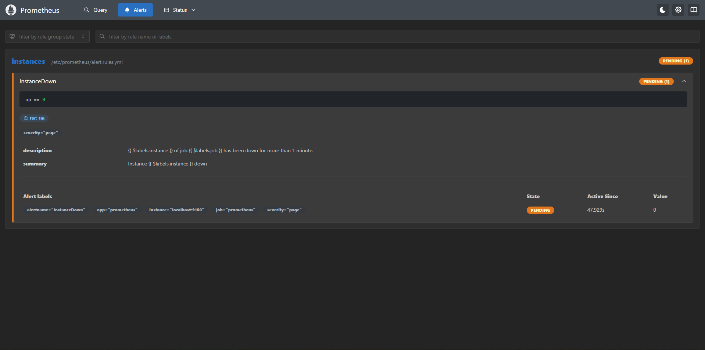
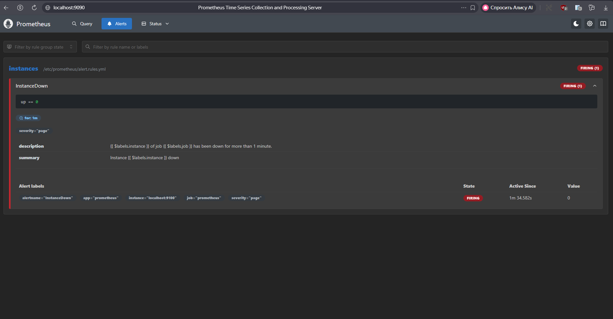
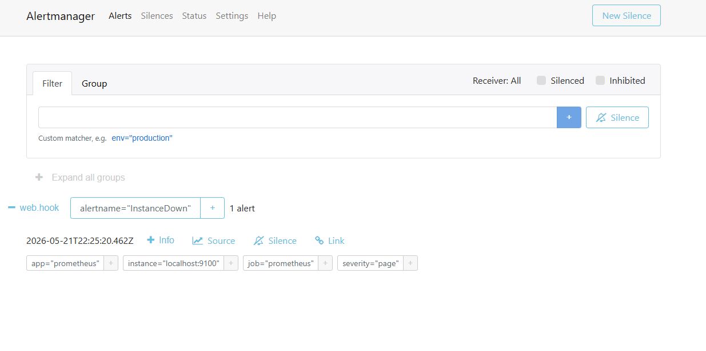
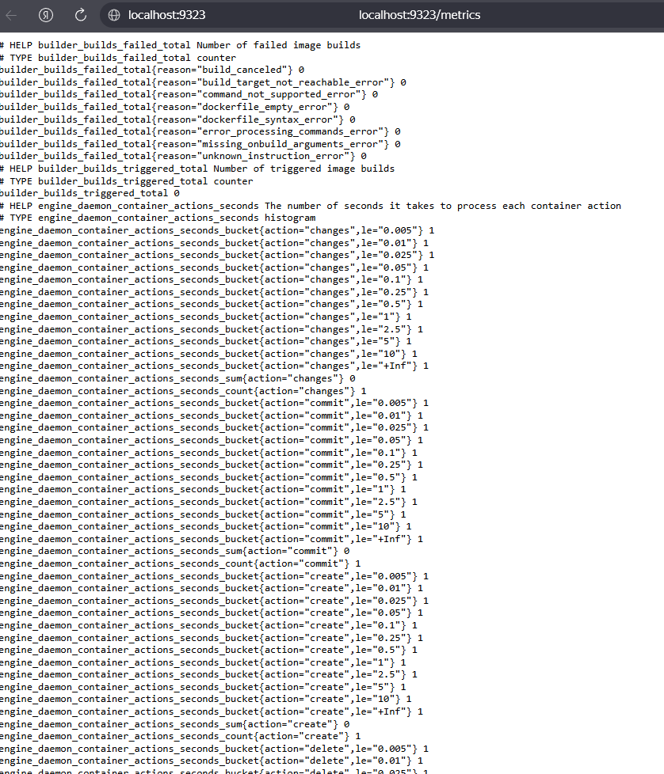
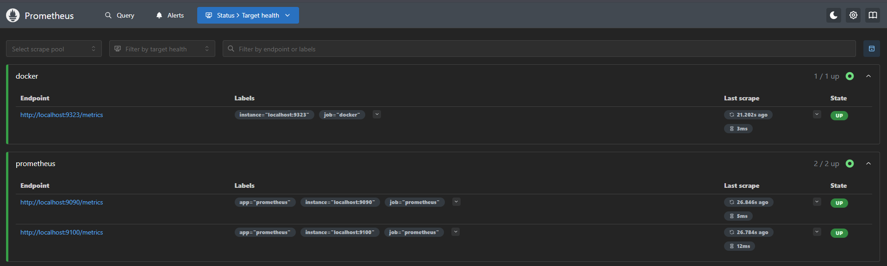
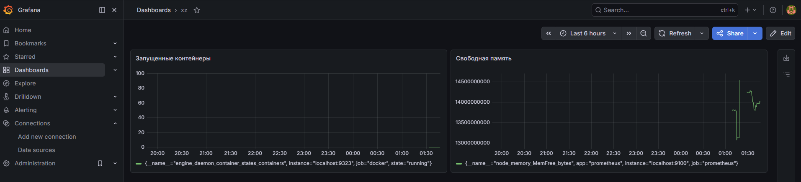

# Домашнее задание к занятию «Система мониторинга Prometheus. Часть 2» — Сидоренко Алексей

### Цели задания
1. Научиться настраивать оповещения в Prometheus.
2. Научиться устанавливать Alertmanager и интегрировать его с Prometheus.
3. Научиться активировать экспортёр метрик в Docker и подключать его к Prometheus.
4. Научиться создавать дашборд Grafana.

---

### Задание 1

**Условие:** Создайте файл с правилом оповещения, как в лекции, и добавьте его в конфиг Prometheus.
**Требование:** Погасить node exporter, стоящий на мониторинге, и прикрепить скриншот раздела оповещений Prometheus, где оповещение будет в статусе Pending.

**Решение:**
Был создан файл правил `alert.rules.yml` и подключен в `prometheus.yml`. После остановки службы `node_exporter` оповещение перешло в ожидающий статус.

Результат (статус Pending):

---

### Задание 2

**Условие:** Установите Alertmanager и интегрируйте его с Prometheus.
**Требование:** Прикрепить скриншот Alerts из Prometheus, где правило оповещения будет в статусе Firing, и скриншот из Alertmanager, где будет видно действующее правило оповещения.

**Решение:**
Был развернут Alertmanager и настроена интеграция со стороны Prometheus. Спустя заданное время оповещение перешло в активную фазу и успешно передалось в панель алертов.

Результат из Prometheus (статус Firing):

Результат из Alertmanager:

---

### Задание 3

**Условие:** Активируйте экспортёр метрик в Docker и подключите его к Prometheus.
**Требование:** Приложить скриншот браузера с открытым эндпоинтом, а также скриншот списка таргетов из интерфейса Prometheus.

**Решение:**
В конфигурационном файле `/etc/docker/daemon.json` был включен сбор метрик на порту 9323. После этого в конфигурацию Prometheus добавлена соответствующая джоба.

Скриншот открытого эндпоинта метрик Docker в браузере:

Скриншот списка таргетов (Targets) в Prometheus со статусом UP:

---

### Задание 4* (со звездочкой)

**Условие:** Создайте свой дашборд Grafana с различными метриками Docker и сервера, на котором он стоит.

**Решение:**
В Grafana был добавлен источник данных Prometheus и создан кастомный дашборд, объединяющий метрики количества запущенных контейнеров Docker (`engine_daemon_container_states_containers`) и свободной оперативной памяти сервера (`node_memory_MemFree_bytes`).

Скриншот созданного дашборда:

